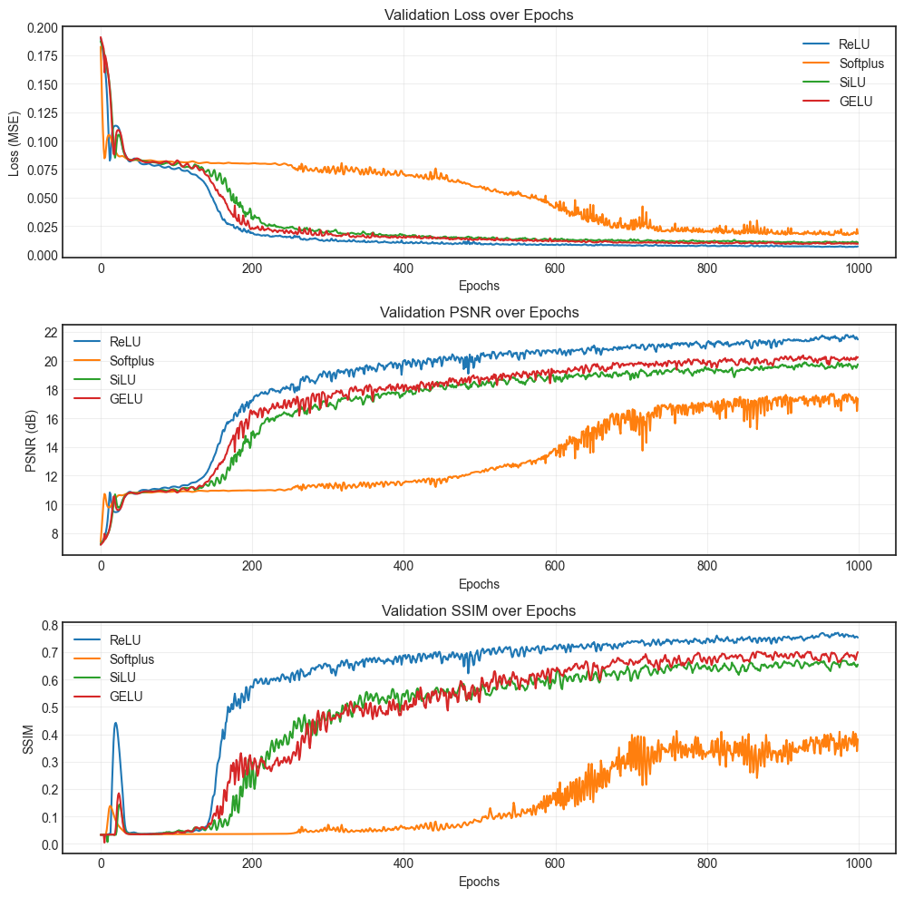

# NeRF Implementation (PyTorch)

This project is a PyTorch implementation of a Neural Radiance Field (NeRF) 
trained and tested on the Lego dataset (Blender). Includes positional encoding, hierarchical sampling, and volumetric rendering.

## 📁 Project structure

```
NeRF-PyTorch-3D-Vision/
├── data/
│   └── tiny_nerf_data.npz              # Lego Dataset
├── logs/                               # Checkpoints, historics, model dumps
│   ├── gelu/
│   ├── relu/
│   ├── silu/
│   └── softplus/
├── notebooks/                          # Notebook for results visualization
│   └── results_exploration.ipynb
├── outputs/                            # Contains visual outputs
├── config.yaml                         # Global configuration (training, rendering, dataset)
├── dataset.py                          # Dataset class
├── rays_utils.py                       # Rays utils
├── model.py                            # NeRF model and positional encoding
├── rendering.py                        # Volumetric rendering functions
├── sampling.py                         # Ray sampling and depth-to-position conversion
├── metrics.py                          # PSNR metric
├── trainer.py                          # Training loop, validation, and checkpointing
└── main.py                             # Entry point for launching training
```
---

## 📦 Requirements
Install dependencies from `requirements.txt`:
```bash
pip install -r requirements.txt
```

## 🚀 Training

**Run training:**
```bash
python main.py
```

## 📷 Results & Learning Curves

<p align="center">
  
</p>

> The training and validation losses decrease rapidly during the first 200 epochs, then gradually stabilize, indicating that the model converges efficiently without signs of overfitting. It is interesting to note a plateau during the early learning phase (around the first 200 iterations), which corresponds to the network primarily capturing low-frequency components such as global colors and coarse geometry. As training progresses, NeRF gradually learns higher-frequency details, refining textures, edges, and lighting transitions. The PSNR follows a similar trajectory, reaching around 21–22 dB at convergence, which aligns with expected performance on the TinyNeRF Lego dataset.

<p align="center">
  
</p>

> The reconstructions illustrate this frequency-based learning process. Around epoch 200, the model reconstructs the overall shape and color distribution but remains blurry. By epoch 400, the contours become clearer, and from epochs 600 to 1000, the scene gains sharpness and depth consistency, revealing finer structures and specular details characteristic of successful volumetric rendering.

<p align="center">
  
</p>

> This 360° rendering demonstrates the full capability of the trained NeRF to synthesize consistent novel views of the scene, confirming that the model has successfully captured the underlying 3D geometry and radiance field of the object.

<p align="center">
  
</p>

> This figure shows the impact of activation choice (ReLU, GELU, SiLU, Softplus) on NeRF’s convergence and reconstruction quality. ReLU and GELU exhibit faster convergence, higher PSNR, and sharper structural similarity (SSIM), while Softplus remains smoother but significantly slower to capture fine details.

- ReLU and GELU introduce strong non-linear transitions that allow the MLP to represent high-frequency components of the radiance field earlier in training (edges, textures, lighting discontinuities).
- In contrast, Softplus saturates more gradually, acting as a low-pass filter that slows the learning of high-frequency details. As a result, it converges more slowly and produces blurrier reconstructions in early training stages.


> The models were trained for 1000 epochs with a batch size of 1024, a learning rate of 5e-4 (Adam optimizer with exponential decay), 64 samples per ray over a depth range of [2.0, 6.0] with a sinusoidal positional encoding (L = 10/4) and a 256-neuron MLP architecture, using Google Colab on a Tesla T4 GPU.

## 📝 Notes

> Gaussian Positional Encoding is still a work in progress

## 📚 References

This implementation was inspired by the original NeRF paper:  
**Mildenhall et al., “NeRF: Representing Scenes as Neural Radiance Fields for View Synthesis”, ECCV 2020.**

Additional insights and details:  
- [Minimal Implementation of NeRF using JAX and Flax — Saurav Maheshkar & Soumik Rakshit](https://www.kaggle.com/code/sauravmaheshkar/jax-flax-minimal-implementation-of-nerf)  
- [Tiny-NeRF (PyTorch) — Rkuo2000](https://www.kaggle.com/code/rkuo2000/tiny-nerf/notebook)
